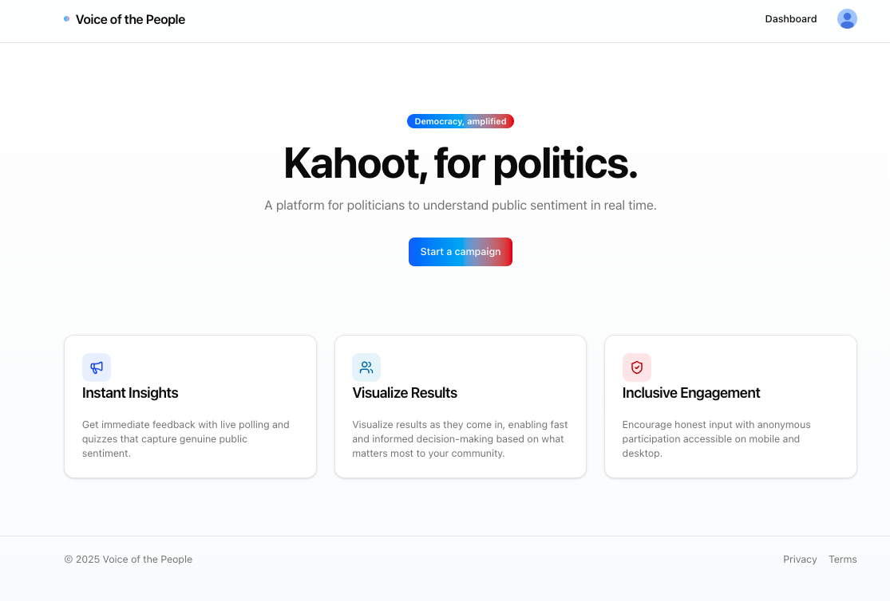
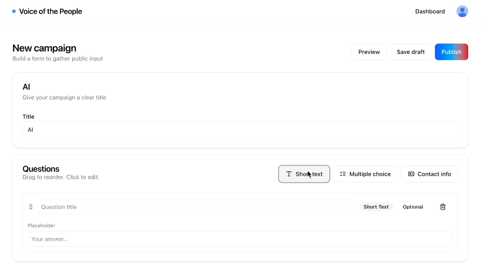
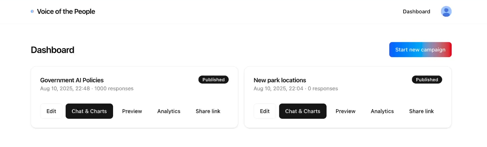
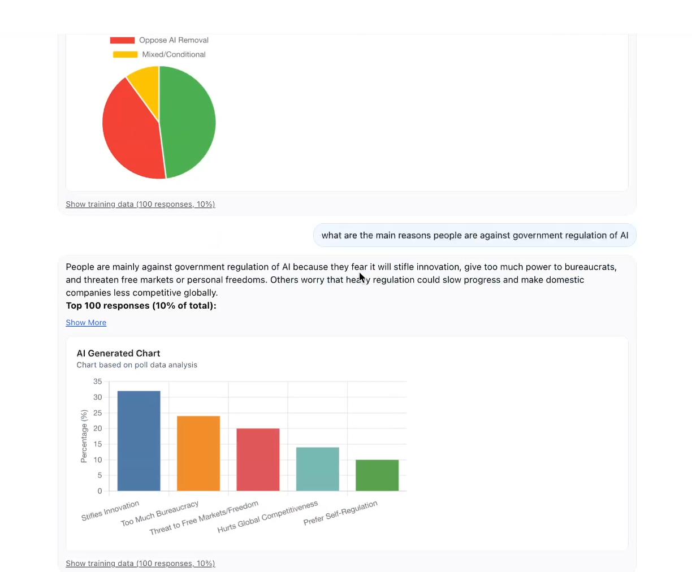

# Voice of the People

<div align="center">

</div>

A platform for collecting and analyzing political sentiment through surveys and AI-powered classification.

**3rd Place Winner at the Cognition Hackathon** - Recognized for innovative use of AI in civic engagement and political analysis.

🔗 **[Read more about this project](YOUR_POST_LINK_HERE)**

## Overview

Voice of the People allows politicians and organizations to create surveys with custom questions, collect responses from the public, and analyze political sentiment and ideological leanings using machine learning models. Think of it as Kahoot for politics.

## Key Features

- **Survey Management**: Create, edit, and publish political surveys with multiple question types
- **Real-Time Analytics**: AI-powered political sentiment analysis (left/center/right classification)
- **Advanced Visualizations**: Chat to graph creation for deep data insights
- **Interactive Dashboards**: Rich charts and data exploration tools
- **Public Participation**: Shareable campaign links for public engagement

### Campaign Builder

<div align="center">

</div>

### Analytics Dashboard

<div align="center">

</div>

### Chat-to-Graphs Feature

<div align="center">

</div>

## Architecture

This project consists of three main components:

### 1. **Frontend** (`/frontend`)

- **Tech Stack**: Next.js 15, React 19, TypeScript, Tailwind CSS
- **Features**:
  - Campaign creation and management interface
  - Real-time analytics dashboard with Chart.js and Recharts
  - User authentication via Clerk
  - Responsive design with modern UI components
- **Key Pages**:
  - Dashboard for campaign overview
  - Campaign editor with drag-and-drop question builder
  - Analytics page with data visualizations
  - Public campaign participation pages

### 2. **AI Backend** (`/ai/backend`)

- **Tech Stack**: FastAPI, PyTorch, Transformers, scikit-learn
- **ML Models**:
  - Political leaning classifier: `matous-volf/political-leaning-politics`
  - Tokenizer: `launch/POLITICS`
- **Features**:
  - Real-time political sentiment classification
  - Ideology scoring with continuous [-1,1] scale
  - Dimensionality reduction (PCA, t-SNE, UMAP)
  - Batch processing for efficient analysis
  - CORS-enabled API for web integration

### 3. **Synthetic Indexer** (`/syntheticindexer`)

- **Tech Stack**: Python, Node.js, Supabase
- **Purpose**: Data generation and indexing for testing and demonstration
- **Features**: Synthetic political Q&A generation with diverse ideological perspectives

## Getting Started

### Prerequisites

- Node.js 18+
- Python 3.8+
- OpenAI API key (for data generation)

### Quick Setup

#### 1. Frontend Setup

```bash
cd frontend
npm install
npm run dev
```

The frontend will run on `http://localhost:3000`

#### 2. AI Backend Setup

```bash
cd ai/backend
pip install -r requirements.txt
python server.py
```

The API will run on `http://localhost:8000`

#### 3. Synthetic Indexer (Optional)

```bash
cd syntheticindexer
pip install -r requirements.txt
npm install
python server.py
```

### Environment Variables

Create `.env.local` files with the required API keys:

**Frontend** (`/frontend/.env.local`):

```env
NEXT_PUBLIC_CLERK_PUBLISHABLE_KEY=your_clerk_key
CLERK_SECRET_KEY=your_clerk_secret
NEXT_PUBLIC_SUPABASE_URL=your_supabase_url
NEXT_PUBLIC_SUPABASE_ANON_KEY=your_supabase_key
```

**AI Backend** (`/ai/backend/.env`):

```env
OPENAI_API_KEY=your_openai_key
```

## AI & Machine Learning

### Political Sentiment Analysis

- **Model**: Pre-trained transformer model for political leaning classification
- **Output**: Three-class classification (left, center, right) with confidence scores
- **Ideology Scoring**: Continuous ideological positioning using classifier weight analysis
- **Uncertainty Metrics**: Entropy and margin calculations for confidence assessment

### Advanced Analytics

- **PCA**: Principal component analysis for high-level data patterns
- **t-SNE**: Non-linear projection for cluster visualization
- **UMAP**: Uniform manifold approximation for topology preservation
- **Real-time Processing**: Batch processing for responsive user experience

## Data Visualization

The platform includes interactive visualizations:

- **Sentiment Distribution**: Pie charts and bar charts showing political leaning breakdown
- **Ideology Mapping**: Scatter plots with dimensionality reduction projections
- **Time Series**: Response trends over time
- **Demographic Analysis**: Sentiment by age, gender, region, party affiliation
- **Interactive Filters**: Dynamic filtering and drill-down capabilities

## Development & Testing

### Synthetic Data Generation

Generate test data with diverse political perspectives:

```bash
cd ai/backend
python generate_political_qa.py --num-lines 100 --mode ideology
```

### API Testing

The AI backend provides a health check and analysis endpoint:

- `GET /health` - Service status
- `POST /analyze` - Analyze Q&A pairs for political sentiment

### Visualization Testing

```bash
cd ai/backend
python classify_and_visualize.py --input data/political_qa.jsonl
```

## Deployment

The platform is designed for cloud deployment:

- **Frontend**: Deploy on Vercel or Netlify
- **AI Backend**: Deploy on AWS, GCP, or Azure with GPU support for optimal performance
- **Database**: Supabase for user data and campaign storage

## Use Cases

- **Politicians**: Gauge public opinion on policy proposals
- **Campaigns**: Test messaging and understand voter sentiment
- **Researchers**: Study political attitudes and ideological distributions
- **Organizations**: Collect structured feedback on political topics
- **Citizens**: Participate in democratic discourse and see where they stand
